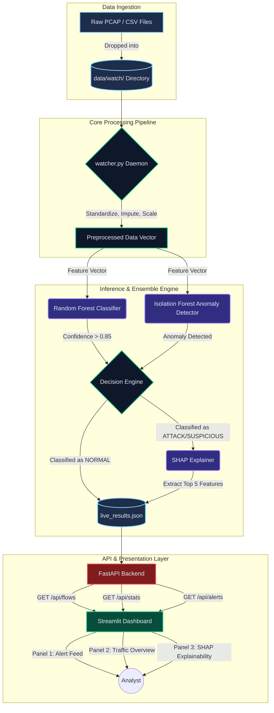

# IDS-ML System Architecture

This document illustrates the high-level system architecture and data flow for the Intrusion Detection System (IDS-ML) project.

## Architecture Diagram

### Components
1. **Data Ingestion:** Raw network flow data is deposited into a watch folder.
2. **Preprocessing:** A daemon monitors the folder and processes new data to prepare it for inference.
3. **Inference Engine:** An ensemble of a supervised Random Forest and an unsupervised Isolation Forest classify the network flows.
4. **Explainability:** SHAP is used to explain the reasoning behind flagged malicious flows.
5. **API & UI:** The results are stored locally and served via FastAPI to a 5-panel Streamlit Dashboard for analysts.
